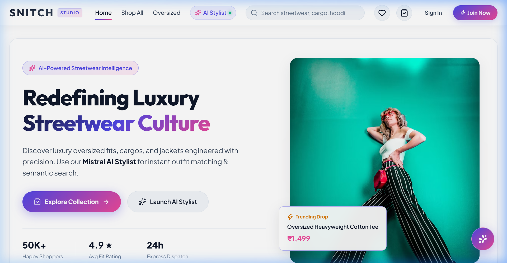

# 🛍️ Snitch Fullstack



A full-stack **MERN E-Commerce Application** inspired by the Snitch clothing brand.  
Built with secure authentication, product management, cloud image uploads, shopping cart, **AI-powered semantic search**, **server-side pagination**, an **AI Shopping Assistant chatbot & AI Stylist workspace**, **Light Studio White UI**, and an **MCP tool server** for AI-agent integration.

---

## 🚀 Key Features & Highlights

### 🎨 Light Studio White Design System
- **Luxury Aesthetic**: High-contrast, clean Light Studio theme featuring `#ffffff` base canvas, `#f8fafc` porcelain surfaces, and deep slate typography (`#0f172a`).
- **Glassmorphism Navbar**: Translucent fixed navigation header with real-time category dropdowns, live search, cart counter, and wishlist sync.
- **Responsive Animations & Modals**: Micro-interactions across Product Cards, Quick View overlays, Wishlist toggles, and Recently Viewed carousels.

### ⚡ Seamless Client-Side Navigation & Stability
- **Zero-Reload Routing**: Fully synchronized client-side routing across all paths (`/`, `/products`, `/products/:id`, `/ai-assistant`, `/wishlist`, `/cart`, `/checkout`, `/orders`, `/profile`).
- **React Hooks Compliance**: Guaranteed unconditional hook order execution across all component trees to eliminate client-side blank screens and render crashes.
- **Scroll Restoration**: Automatic `<ScrollToTop />` router listener ensuring smooth page transitions reset to the top.

### 🔐 Authentication
- User Registration & Login (JWT + HTTP-only Cookies)
- Logout & Get Current User Profile
- Protected Routes & Admin Access Control
- Google OAuth Integration

### 📦 Product Management & Filtering
- Create / Update / Delete Products (protected admin routes)
- Get All Products *(paginated & multi-field sorted)*
- Get Product by ID with mount-safe data fetching
- Category Navigation with `useSearchParams` URL state sync
- Cloud Image Upload via **ImageKit**
- Stock Level Management, Price Range Sliders & Advanced Filter Drawer

### 🛍️ Wishlist, Cart & Order Tracking
- **Persistent Wishlist**: MongoDB-backed wishlist syncing across sessions and devices.
- **Interactive Cart**: Quantity adjustment, stock validation, and coupon engine integration.
- **Order Management**: Order placement, address input, invoice generator, and interactive stepper tracking.

### 🤖 AI Shopping Assistant & AI Stylist
- **Floating ChatBot**: High z-index (`99999`) floating assistant widget accessible on every route.
- **Dedicated AI Stylist Workspace (`/ai-assistant`)**: Full-screen conversational AI workspace with prompt suggestions, outfit pairing, and semantic inventory queries.
- **Mistral AI Function Calling**: Autonomously executes backend tools to query live database items.
- **High Availability Database Fallback**: Automatic fail-safe fallback to regex search if AI services experience latency or rate-limiting.

### 🔍 AI Semantic Search
- Vector Embeddings generated via **Mistral AI Embeddings**
- Fast vector similarity search powered by **Pinecone**
- Automated vector lifecycle management (syncs vector database on product create/update/delete)

### 🛠️ MCP Tools (AI Agent Integration)
An **MCP (Model Context Protocol) server** exposes all backend APIs as structured tools for AI agents (Antigravity IDE, Claude Desktop, etc.).

| Tool | Description |
|---|---|
| `auth_register` | Register a new user |
| `auth_login` | Login and receive session cookie |
| `auth_get_me` | Get current user profile |
| `auth_logout` | Logout |
| `get_all_products` | Paginated product list |
| `get_product_by_id` | Single product detail |
| `get_products_by_category` | Paginated by category |
| `get_categories` | All distinct categories |
| `search_products` | AI semantic search |
| `cart_get` | View cart |
| `cart_add` | Add item to cart |
| `cart_remove` | Remove item |
| `cart_clear` | Clear entire cart |

### 🔒 Security
- JWT Authentication with HTTP-only Cookies
- Password Hashing (bcrypt)
- Protected REST APIs & CORS Configuration

---

## 🛠 Tech Stack

### Frontend
- React + Vite
- React Router (DOM)
- Axios & React Context
- SCSS Modules + Custom CSS Design System

### Backend
- Node.js + Express.js
- MongoDB + Mongoose
- Multer + ImageKit SDK
- JWT + Cookie Parser

### AI Stack
- **Mistral AI** — Embeddings & Function-Calling Chat Models (`mistral-small-latest`)
- **LangChain** — Vector Store & Embedding Wrappers
- **Pinecone** — Cloud Vector Database

### MCP Server
- [`@modelcontextprotocol/sdk`](https://www.npmjs.com/package/@modelcontextprotocol/sdk)
- Axios + Zod

---

## 📂 Project Structure

```text
snitch-fullstack/
│
├── Backend/
│   └── src/
│       ├── controllers/
│       │   ├── auth.controller.js
│       │   ├── post.controller.js       ← pagination & catalog APIs
│       │   ├── cart.controller.js
│       │   └── chat.controller.js       ← AI chatbot & tool caller
│       ├── routes/
│       │   ├── auth.routes.js
│       │   ├── post.routes.js
│       │   ├── cart.routes.js
│       │   └── chat.routes.js
│       ├── models/
│       │   ├── user.models.js
│       │   ├── post.models.js
│       │   └── cart.models.js
│       ├── middleware/
│       └── config/
│
├── Frontend/
│   └── src/
│       ├── App.jsx                      ← Global providers & Floating ChatBot
│       ├── feature/
│       │   ├── chat/
│       │   │   ├── ChatBot.jsx          ← High-z-index floating assistant
│       │   │   ├── ChatBot.module.scss
│       │   │   ├── pages/AiAssistant.jsx← Dedicated AI Stylist workspace
│       │   │   ├── hooks/useChat.js
│       │   │   └── service/chat.api.js
│       │   ├── posts/
│       │   │   ├── pages/Products.jsx   ← Filters, pagination & category sync
│       │   │   ├── pages/ProductDetail.jsx
│       │   │   ├── posts.context.jsx
│       │   │   └── service/post.api.jsx
│       │   ├── cart/
│       │   └── auth/
│       └── components/
│           ├── Header.jsx               ← Glassmorphism luxury header
│           ├── ScrollToTop.jsx          ← Automatic route scroll reset
│           └── RecentlyViewedCarousel.jsx
│
├── mcp-server/
│   ├── index.js                         ← 13 MCP tools
│   └── package.json
│
├── .agents/
│   └── mcp_config.json                  ← Antigravity IDE auto-load
│
└── README.md
```

---

## 📦 Installation & Setup

### 1. Clone Repository
```bash
git clone https://github.com/sandeep7348/snitch-fullstack.git
cd snitch-fullstack
```

### 2. Backend Setup
```bash
cd Backend
npm install
```

Create a `.env` file in `Backend/`:
```env
PORT=3000
MONGODB_URL=your_mongodb_connection_string
JWT_SECRET=your_jwt_secret

IMAGE_KIT_PUBLIC_KEY=your_public_key
IMAGE_KIT_PRIVATE_KEY=your_private_key
IMAGE_KIT_URL_ENDPOINT=your_url_endpoint

MISTRAL_API_KEY=your_mistral_api_key

PINECONE_API_KEY=your_pinecone_api_key
PINECONE_INDEX_NAME=your_pinecone_index_name
```

Start dev server:
```bash
npm run dev
```

### 3. Frontend Setup
```bash
cd Frontend
npm install
npm run dev
```

### 4. MCP Server Setup
```bash
cd mcp-server
npm install
npm start
```

---

## 🌐 REST API Reference

### Authentication
| Method | Endpoint | Description |
|--------|----------|-------------|
| POST | `/api/auth/register` | Register new user account |
| POST | `/api/auth/login` | Authenticate user & issue session cookie |
| GET  | `/api/auth/getMe` | Fetch current user session |
| POST | `/api/auth/logout` | Clear user session cookie |

### Products & Catalog
| Method | Endpoint | Query Params |
|--------|----------|-------------|
| POST   | `/api/post` | — (Admin create product) |
| GET    | `/api/allpost` | `page`, `limit`, `sort`, `search` |
| GET    | `/api/post/:id` | — |
| PUT    | `/api/post/:postId` | — |
| DELETE | `/api/post/:postId` | — |
| GET    | `/api/category/:category` | `page`, `limit` |
| GET    | `/api/categories` | — (Distinct categories list) |
| POST   | `/api/search` | — (AI Semantic search query) |

### Shopping Cart & Wishlist
| Method | Endpoint | Description |
|--------|----------|-------------|
| GET    | `/api/cart` | View current user cart |
| POST   | `/api/cart/add` | Add product to cart |
| DELETE | `/api/cart/remove/:postId` | Remove single item |
| DELETE | `/api/cart/clear` | Empty cart |
| GET    | `/api/wishlist` | Fetch wishlist items |
| POST   | `/api/wishlist/toggle` | Toggle item in wishlist |

### Orders
| Method | Endpoint | Description |
|--------|----------|-------------|
| POST   | `/api/orders` | Place new order |
| GET    | `/api/orders` | Fetch user order history |
| DELETE | `/api/orders/:id` | Cancel order |

### AI Chatbot
| Method | Endpoint | Body |
|--------|----------|------|
| POST | `/api/chat` | `{ messages: [{role, content}] }` |

---

## 🗺️ Completed & Upcoming Roadmap

- [x] Luxury Light Studio White Theme Redesign
- [x] Client-Side Navigation Stability & Blank Screen Fixes
- [x] Floating ChatBot Widget & AI Stylist Workspace (`/ai-assistant`)
- [x] MongoDB Persistent Wishlist Sync
- [x] Order Management & Stepper Tracking
- [x] Product Reviews & Ratings Component
- [x] Recently Viewed Items Carousel
- [x] Product Stock Validation & Filters
- [x] Google OAuth Integration
- [x] MCP Server Tools Setup
- [ ] Stripe / Razorpay Payment Gateway Integration
- [ ] Rate Limiting & API Throttling
- [ ] Docker & Docker Compose Setup

---

## 👤 Author

**Sandeep Choudhary**  
GitHub: [github.com/sandeep7348](https://github.com/sandeep7348)

---

⭐ If you found this project useful, consider giving it a star on GitHub!
